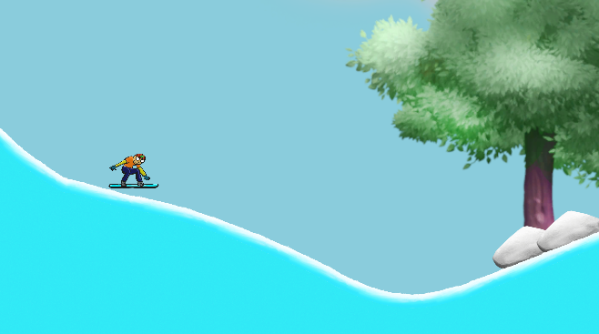

# Snow Boarder 🏂

A 2D snowboarding game made with Unity where players navigate through snowy terrain while performing tricks and avoiding obstacles.

## Features ✨

* Dynamic snowboarding physics system
* Particle effects for snow trails and crashes
* Boost mechanics for speed control
* Score system based on performance
* Sound effects and background music
* Multiple terrain obstacles
* Crash detection system
* Finish line celebration effects

## Screenshots




## Getting Started 🚀

### Prerequisites

* Unity 2020.3 or later
* Basic understanding of Unity's 2D system

### Installation

1. Clone the repository
```bash
git clone https://github.com/SavasTanriverdi/Snow-Boarder.git
```
2. Open the project in Unity Hub
3. Let Unity import all necessary assets
4. Open the main scene from `Assets/Scenes`

## How to Play 🎮

* Use **Left Arrow** and **Right Arrow** keys to rotate the snowboarder
* Press **Space** to boost speed
* Try to reach the finish line without crashing
* Master the terrain to achieve the best time

## Technical Details 🔧

The game is built using:
* Unity 2D Physics System
* Surface Effector 2D for snow movement
* Particle Systems for visual effects
* Scene Management for level progression
* Tag-based collision detection

## Project Structure 📁

```
Assets/
├── Scripts/
│   ├── PlayerController.cs
│   ├── CrashDetector.cs
│   ├── DustTrail.cs
│   └── FinishLine.cs
├── Scenes/
├── Sprites/
├── Audio/
└── Particles/
```

## Contributing 🤝

1. Fork the project
2. Create your feature branch (`git checkout -b feature/AmazingFeature`)
3. Commit your changes (`git commit -m 'Add some AmazingFeature'`)
4. Push to the branch (`git push origin feature/AmazingFeature`)
5. Open a Pull Request

## License 📝

This project is licensed under the MIT License - see the LICENSE file for details

## Acknowledgments 🙏

* Game assets and sound effects from [source]
* Inspired by classic snowboarding games
* Thanks to all contributors and testers
